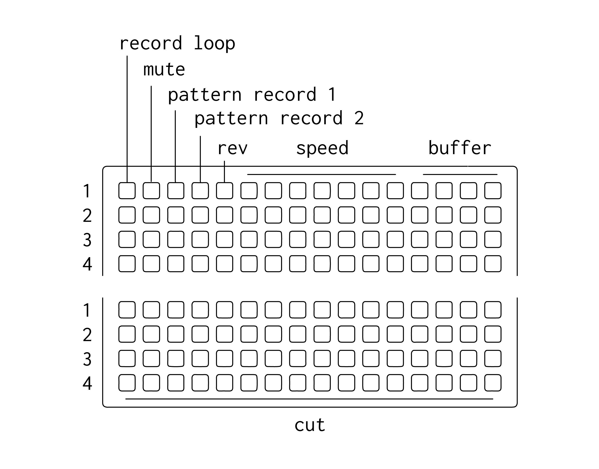

# anaphora

playable varispeed delay/looper in max for live. a variation on mlr by brian crabtree. rough around the edges.

a sort-of-polished-up version of of a [norns mlr](https://llllllll.co/t/mlr-norns/21145/175)-inspired delay/looper I've been using quite a bit for the last year. excels at expressive glitchy improv stuff. largely untested, plz post issues if (when) they arise. don't foresee a lot of future updates to this, since I'm mainly focused on building some new less glitchy ideas and ports in max with the soon-to-be-completed `softcut~`.

differences from norns mlr include:

* a simplified 1-page / 4-buffer layout. lets you cut, repitch, record and switch buffers simultaneously, all of which can be pattern recorded.
* unlike `softcut`, the audio engine is home-brewed in max and has a lot of glitchy/rough edges, including buffer clicks & varispeed record/playback resampling artifacts. [think early-2000's microsound.](https://shop.christopherwillits.com/album/folding-and-the-tea) this is all semi-intentional and I'm not looking to alter the behavior for this app.
* alternate record speed / play speed / overdub architecture. at overdub(fb) = 0, record speed is locked at 1, speed controls playback. at overdub > 0, playback speed is locked at 1, speed controls record. honesty, no idea why I chose this behavior, but it can be fun.

### Requirements

128 grid (varibright or 2011)

### first steps

1.  open a live set, drop anaphora.amxd in an audio track and record enanable the track.

2.  select your 128 grid from the dropdown on anaphora. make sure 'focus' is enabled

3.  press the top left key on the grid to create a loop. make a sound. press the top left key again to stop the loop. you can also drag and drop existing audio into one of the waveform displays.

4. recording while a channel is muted results in a new loop.

explore ~

